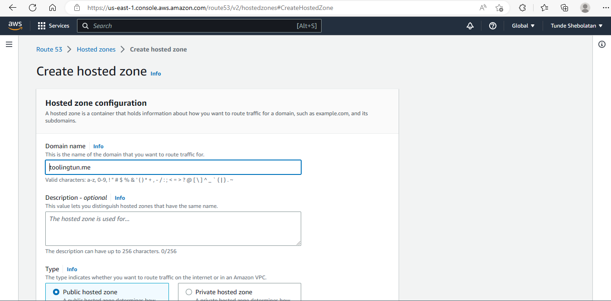
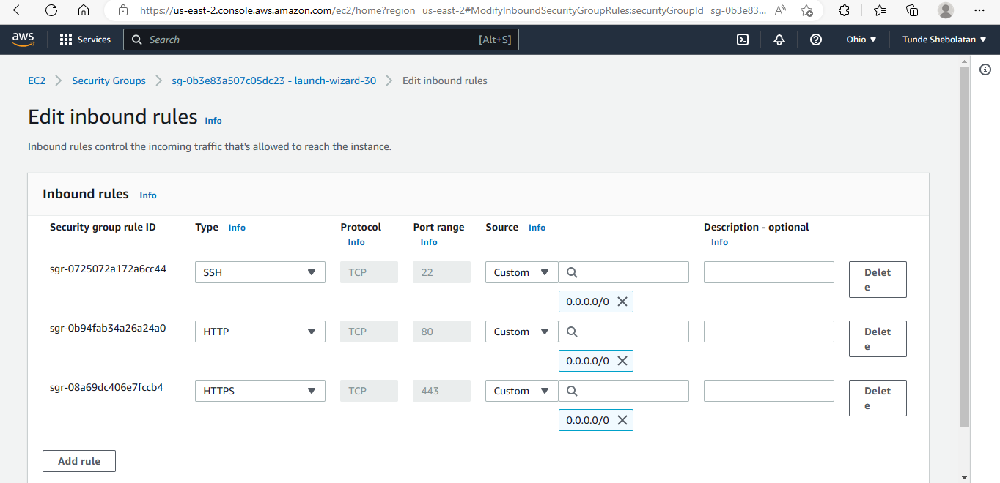

# Project 10: LOAD BALANCER SOLUTION WITH NGINX AND SSL/TLS

CONFIGURE NGINX AS A LOAD BALANCER

Uninstall Apache from the existing Load Balancer server, or create a fresh installation of Linux for Nginx.

Create an EC2 VM based on Ubuntu Server 20.04 LTS and name it Nginx LB (do not forget to open TCP port 80 for HTTP connections, also open TCP port 443 – this port is used for secured HTTPS connections)

Update /etc/hosts file for local DNS with Web Servers’ names (e.g. Web1 and Web2) and their local IP addresses

REGISTER A NEW DOMAIN NAME AND CONFIGURE SECURED CONNECTION USING SSL/TLS CERTIFICATES

Make necessary configurations to make connections to our Tooling Web Solution secured!

In order to get a valid SSL certificate – you need to register a new domain name, you can do it using any Domain name registrar – a company that manages reservation of domain names.

Registered a domain at Domain.com

Link Route 53 to your domain name

Copy all available nameservers on Route 53 to the custom nameservers entry form in the domain create on Domain.com, and click on change nameservers.

Create record for domain name

Complete the task by pointing the record to the Load Balancer public IP

Also create a record for the www

Complete the task by pointing the record to the Load Balancer public IP

Spin-up a new Ubuntu server for the Load Balancer, so the Ec2 dashboard looks like this:

SSH connect to the server

Edit inbound rules for the LB server

Install and configure Nginx as a load balancer to point traffic to the resolvable DNS names of the webservers

Update the instance and Install Nginx

`sudo apt update && sudo apt-get install nginx`

Configure Nginx LB using Web Servers’ names defined in /etc/hosts

Open the default nginx configuration file

`sudo vi /etc/nginx/nginx.conf`

Restart Nginx and make sure the service is up and running

`sudo systemctl restart nginx`

`sudo systemctl status nginx`

To remove the default site so that the reverse proxy will be redirecting to our new configuration file

`sudo rm -f /etc/nginx/sites-enabled/default`

Check if Nginx is successfully configured

`sudo nginx -t`

CD into the Nginx/site-enabled directory/
then link the site available to the sites enabled

`cd /etc/nginx/sites-enabled/`

`ls`

`sudo ln -s ../sites-available/load_balancer.conf .`

`ls`

`ll`

`sudo systemctl reload nginx`

Accessing the tooling website via the browser using the registered domain name

Notice it's not secured. To make it secure, install certbot

`sudo apt install certbot -y`

Install certbot dependency

`sudo nginx -t && sudo nginx -s reload`

Create a certificate to secure the tooling site

`sudo certbot --nginx -d toolingtun.me -d www.toolingtun.me`

Create a crontab to automatically renew the certificate on expiration

 Test renewal command in dry-run mode

`sudo certbot renew --dry-run`

Best practice is to have a scheduled job that will run renew command periodically. Configure a cronjob to run the command twice a day.

To do so, edit the crontab file with the following command:

`crontab -e`

Add following line:

`* */12 * * *   root /usr/bin/certbot renew > /dev/null 2>&1`

